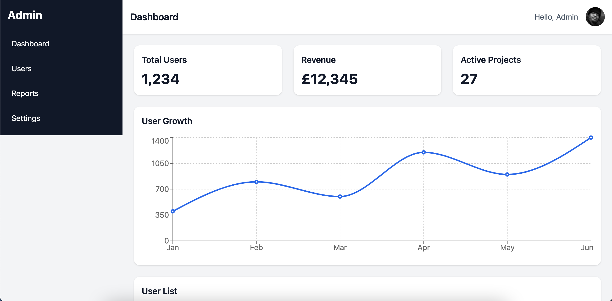
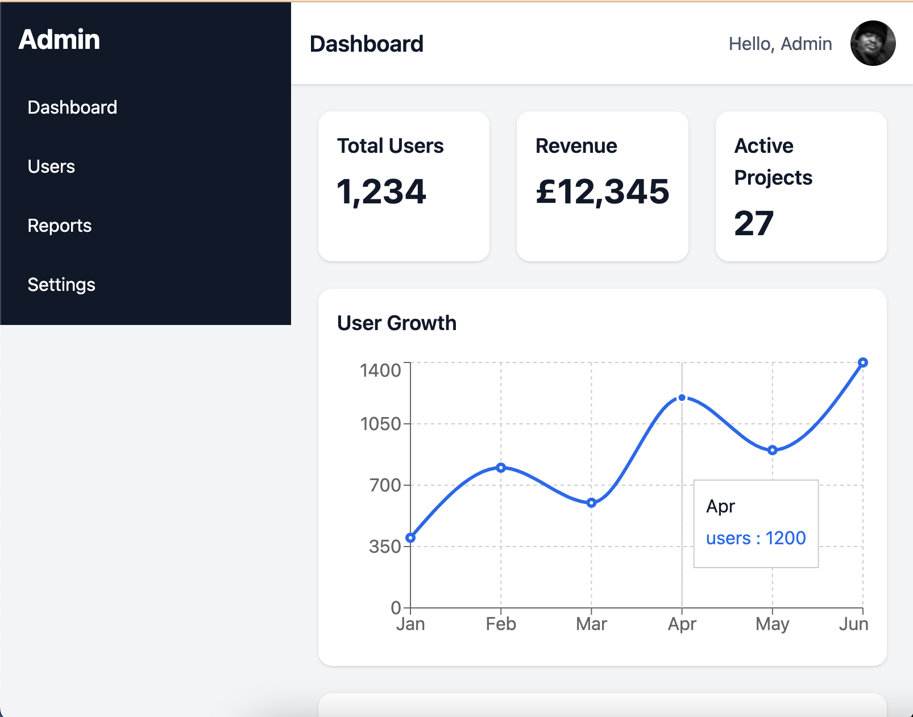
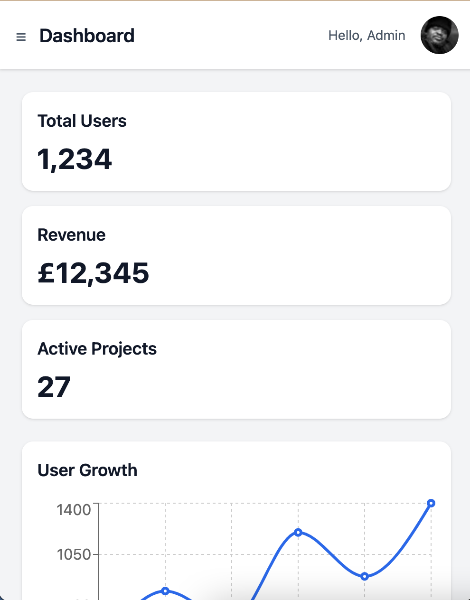

# React Admin Dashboard

A fully responsive **Admin Dashboard** built with **React**, **Vite**, and **Tailwind CSS**.  
Designed for professional portfolios to showcase **frontend development skills**, including responsive layouts, sidebar navigation, cards, charts, and tables.

🔗 **Live Demo:** [https://admin-dashboard-kudostech.vercel.app](https://admin-dashboard-Kudostech.vercel.app)

---

## 🌟 Features

- Responsive sidebar with smooth open/close animations  
- Sidebar menu links scroll smoothly to sections (Dashboard, Users, Reports, Settings)  
- Mobile-friendly layout (stat cards, charts, tables stack nicely)  
- Dashboard stat cards (Total Users, Revenue, Active Projects)  
- Chart section placeholder (easy to integrate any chart library, e.g., Recharts)  
- Users table with horizontal scroll on small screens  
- Clean and modern UI using Tailwind CSS  

---

## 🛠 Tech Stack

- **Frontend:** React (functional components, hooks)  
- **Styling:** Tailwind CSS  
- **Build Tool:** Vite  
- **Optional Chart Library:** Recharts or Chart.js  

---

## 📸 Screenshots

> Add screenshots here after running locally or deploying

- **Desktop View**  


- **Tablet View**  


- **Mobile View**  


---

## 🚀 Getting Started

### 1. Clone the repository
```bash
git clone https://github.com/kudostech/admin-dashboard.git
cd admin-dashboard
```
### 2. Install dependencies
npm install

### 3. Run the development server
npm run dev

### 4. Open in browser
The dashboard will be available at http://localhost:5173 (Vite default port)

---

## ✅ Folder Structure
src/
 ├─ components/
 │   ├─ Header.jsx
 │   ├─ Sidebar.jsx
 │   ├─ ChartCard.jsx
 │   └─ UserTable.jsx
 ├─ screenshots/
 │   ├─ desktop.png
 │   ├─ tablet.png
 │   └─ mobile.png
 ├─ pages/
 │   └─ Dashboard.jsx
 ├─ App.jsx
 └─ main.jsx

---

## 💡 Notes

- The dashboard uses scrollable sections instead of routing for simplicity.

- Can easily integrate charts and dynamic data from APIs.

- Fully responsive and mobile-friendly, ideal for portfolios.

---

## 🎯 Goal
This project demonstrates frontend development skills, including:

- Responsive UI with Tailwind CSS

- React component structure

- Smooth scrolling and interactive sidebar

- Clean, professional layout for portfolio or employment showcase
